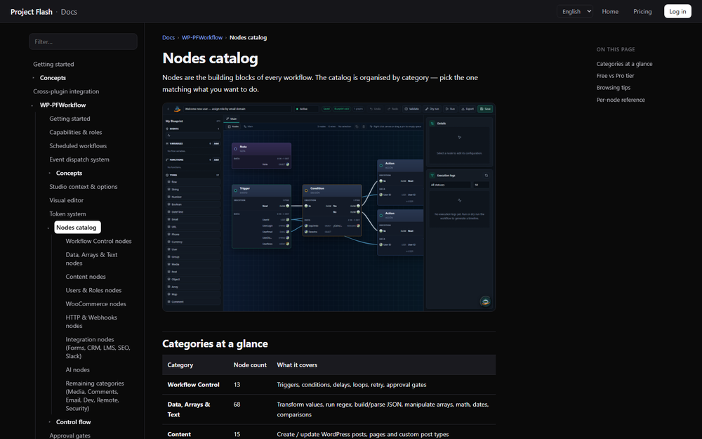
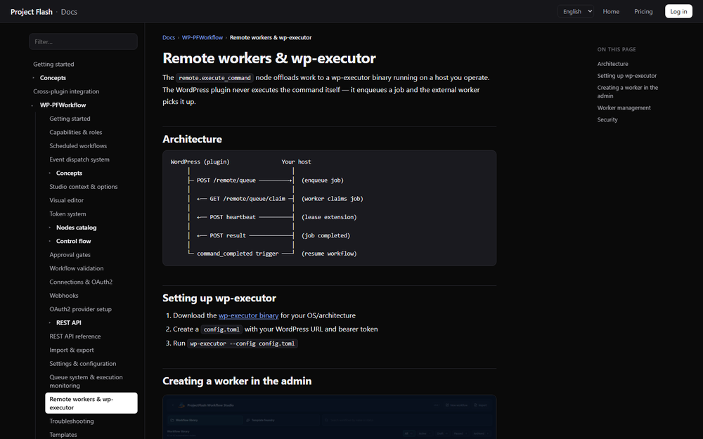
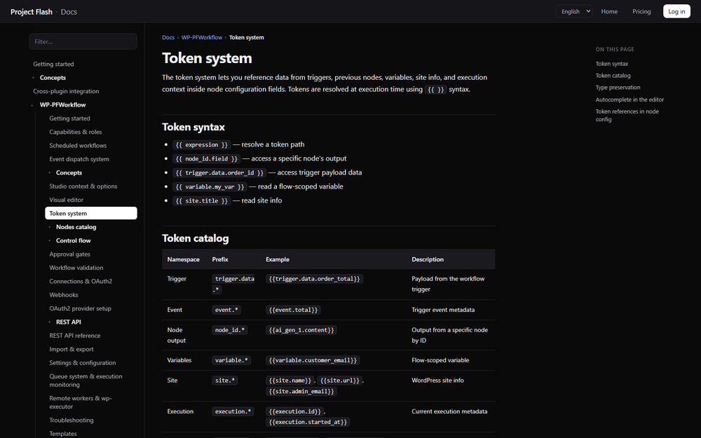

  

<h1 align="center">WP-PFWorkflow™</h1>

<strong>The visual workflow engine for WordPress.</strong>

Automate anything on your site, on a real canvas — part of the <a href="https://setyenv.com">Setyenv™</a> platform.

  <a href="https://setyenv.com"><b>Website</b></a> ·
  <a href="https://setyenv.com/docs/"><b>Documentation</b></a> ·
  <a href="https://setyenv.com/demo/"><b>Live demo</b></a> ·
  <a href="https://setyenv.com/use-case/"><b>Use case</b></a> ·
  <a href="https://setyenv.com/news"><b>News</b></a>

---

**Build automations as diagrams you can open and read.** WP-PFWorkflow is a visual workflow engine, native to WordPress: triggers, conditional branches, function invocations and error boundaries on a real execution canvas — with a queue, retries, replay, timeline and idempotency — running inside your own WordPress install, with no external SaaS.

It is one of the four pieces of the [Setyenv™](https://setyenv.com) suite. It reacts to your site's events natively, pairs with the WP-PFManagement™ low-code platform, reaches your own machine through the open-source [wp-executor](https://github.com/setyenv/wp-executor) runner, and is the engine the [WP-PFAgent™](https://github.com/setyenv/wp-pfagent) AI agent drives from natural language.

> This repository is a **public landing page** for the product. It contains no plugin code — WP-PFWorkflow is a proprietary, per-domain-licensed plugin, available at **[setyenv.com](https://setyenv.com)**.

  

## What it does

### A visual editor that is the production surface

Triggers, conditional branches, function invocations and error boundaries are **first-class graph elements** — not a sketch. You open a workflow and read it like a diagram.

  

### Native triggers across your site

Workflows react to what actually happens on your WordPress:

- **WooCommerce** orders and status changes, **record changes** in WP-PFManagement, **content** events, **schedules** and **webhooks**.
- **Native per-action triggers** — start a workflow directly from any entity action.

### A real execution engine

- **Synchronous-by-default execution** with predictable ordering, plus an async **queue** that drains reliably.
- **Retries, replay, timeline and idempotency** — re-run safely, inspect every past execution.
- **Fault isolation** — a step that fails doesn't take the rest of the automation down.
- **Outbound safety** — an always-on SSRF guard with an egress allowlist for the private-network exceptions you approve.

### Reach your own machine

When a step needs host-side work — shell, files, outbound HTTP — WP-PFWorkflow hands it to the open-source **[wp-executor](https://github.com/setyenv/wp-executor)** runner over an HMAC-signed job queue, executed on hardware you control under a capability and egress allowlist you define.

  

### Connect to anything

- **REST Message & Scripted nodes**, **Table nodes** over WP-PFManagement entities.
- **Tokens** (`client_credentials`) and **OAuth** for authenticated outbound calls.

  

## A worked example

A WooCommerce order becomes a support case, an AI triage, a workflow and host-side work — all inside your WordPress. Full write-up at [setyenv.com/use-case](https://setyenv.com/use-case).

  

## The Setyenv™ platform

  <picture>
    <source media="(prefers-color-scheme: dark)" srcset="assets/logo-setyenv-dark.png" />
    
  </picture>

> **Your own ServiceNow, Zapier, and ChatGPT plugins. Inside WordPress. No SaaS in the middle.**

- **[WP-PFManagement™](https://github.com/setyenv/wp-pfmanagement)** — the low-code platform whose events this engine consumes.
- **WP-PFWorkflow™** *(this product)* — the visual workflow engine.
- **[WP-PFAgent™](https://github.com/setyenv/wp-pfagent)** — the open-source AI agent that builds workflows from a sentence.
- **[wp-executor](https://github.com/setyenv/wp-executor)** — the open-source Rust runner for host-side work.

You **define** data and processes in WP-PFManagement, **automate** them here, reach your **own machine** through wp-executor, and drive all of it in **plain language** with WP-PFAgent.

## Get it

WP-PFWorkflow is a **proprietary, per-domain-licensed WordPress plugin**. The standard build ships obfuscated and is **refundable** — so the purchase is the trial; an optional annual add-on delivers the clean PHP source. Evaluate, buy and license it at **[setyenv.com](https://setyenv.com)**.

---

Setyenv™, WP-PFWorkflow™, WP-PFManagement™ and WP-PFAgent™ are trademarks of Setyenv™.
